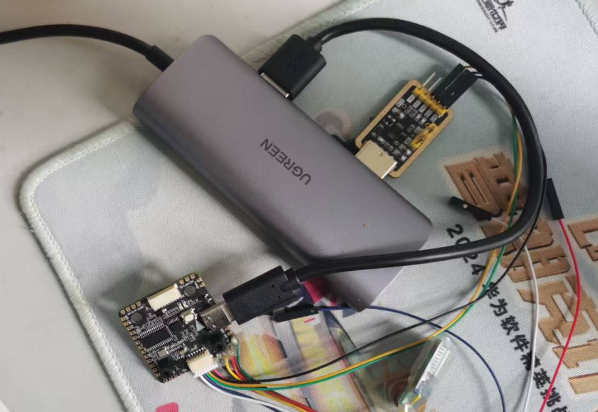

## Quick start

### Prepare a FCU
- flash HEX file in `./modified_BF_firmware/betaflight_4.4.0_STM32H743_forRC.hex` to your FCU (for STM32H743)
- use Type-c to power the FCU, and connect UART port (on FUC) and USB port (on PC) through USB2TTL module, like:
-   
- connect the FC and use mavlink to send FC_data from FCU to PC
- use ls /dev/tty* to check the port id and modified param `USB_path` in `./config/mavlink_param.yaml`
- do this since the default mavlink frequence for rc_channle is too low

### Run demo
- make sure your PC has one GPU at least
- enter your conda env
- install dependencies by: `pip install -e`
- connect the FC and use mavlink to send FC_data from FCU to PC
- run demo by `python main.py`
- use FC to control the sim drone

### Note
- for the urdf file, see `./urdf` 
